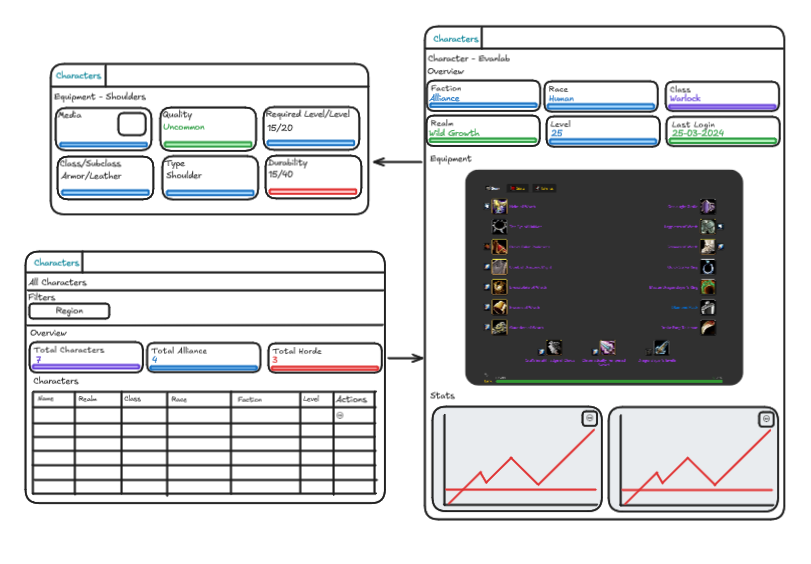

# Planning - V1

The project will should allow users to do the following things in the V1 release:

- List all game characters for the user.
    - They will have the following fields shown:
        - Name
        - Realm
        - Class
        - Race
        - Faction
        - Level
    - The user will be able to view the total characters, total alliance characters and total horde characters on the cards.
    - The user will be allowed to filter characters based on region.
- View the details of a character.
    - Cards with various different information.
    - Equipment pane.
    - Charts highlighting stat changes for character.

## Using the Blizzard APIs

To use the blizzard APIs, we need to setup OAuth client flows.

This will entail

- Having a login page.
- Login page takes you to Blizzard OAuth.
- Blizzard OAuth redirects to local with auth code.
- We retrieve token for user, and pass it back to be stored in cookie storage.
